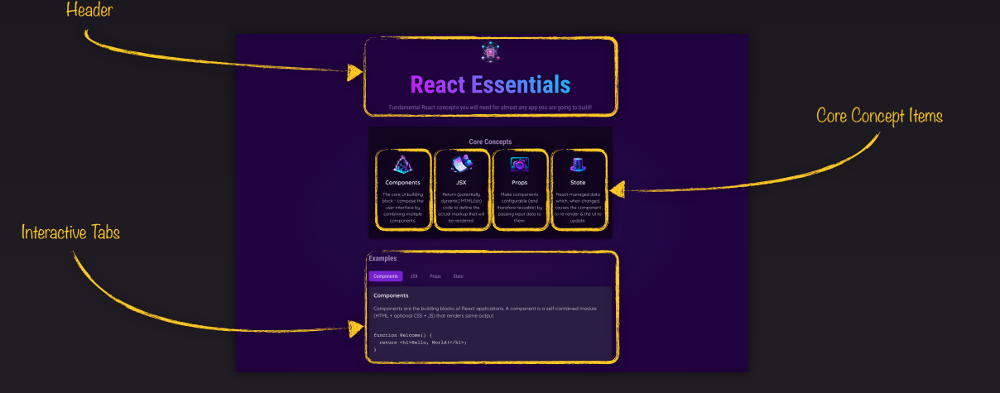

- [Section 1: Getting Started](#section-1-getting-started)
- [Section 2: Javascript refresher](#section-2-javascript-refresher)
- [Section 3: React Enssentials - Component, JSX, Props, State and More](#section-3-react-enssentials---component-jsx-props-state-and-more)
  - [3.1 Component](#31-component)

# Section 1: Getting Started

# Section 2: Javascript refresher

# Section 3: React Enssentials - Component, JSX, Props, State and More

## 3.1 Component

**React Apps Are Built By Combining Components**

- Components
- JSX
- Props

**Build User Interfaces With Components**

- Any website or app can be broken down into smaller building blocks: Component

  

Example react componet

```
import reactImg from '../../assets/react-core-concepts.png';
import './Header.css';

function Header() {
  return (
    <header>
      
      <h1>React Essentials</h1>
      <p>
        Fundamental React concepts you will need for almost any app you are
        going to build!
      </p>
    </header>
  );
}

export default Header;
```
