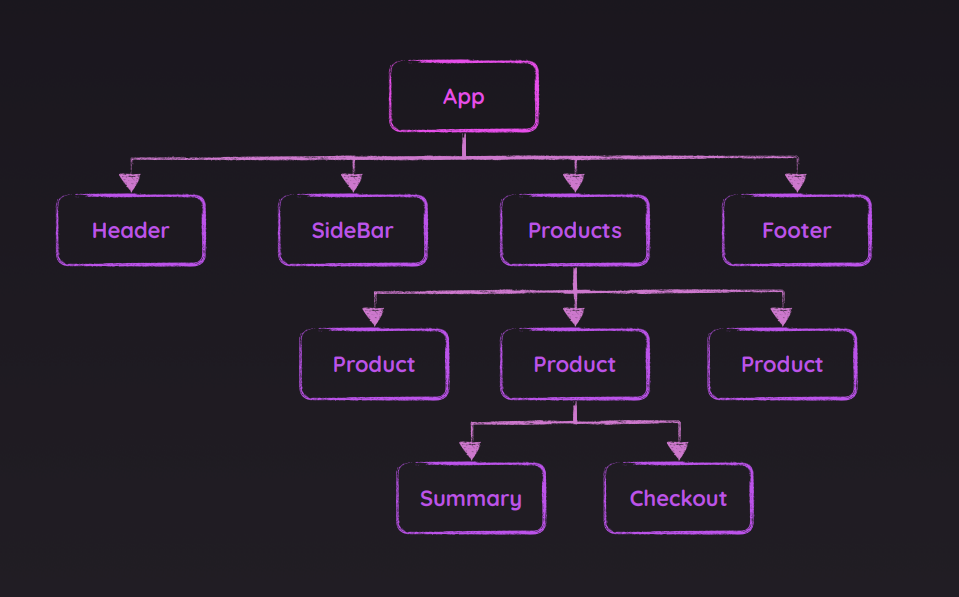
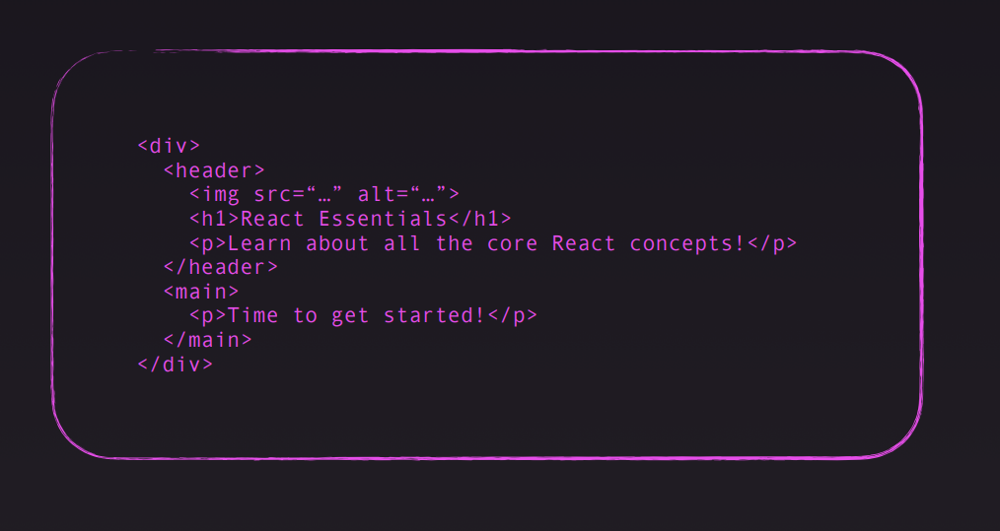
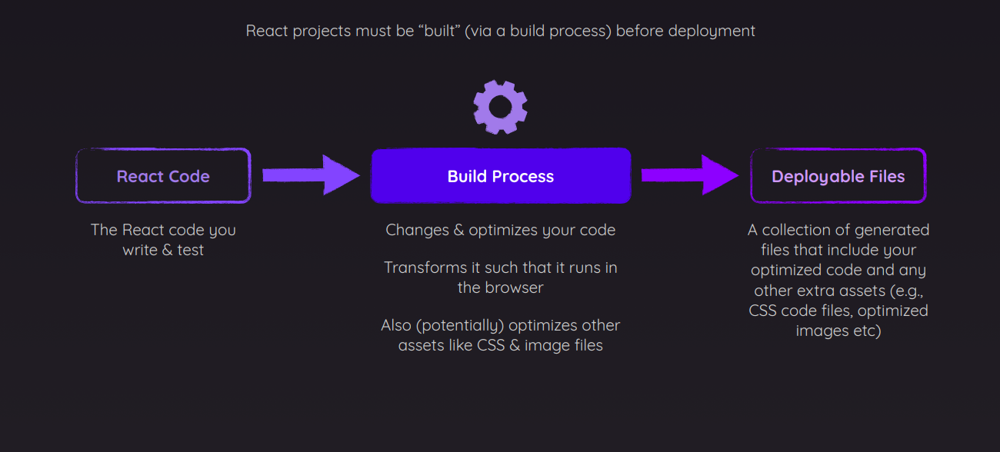
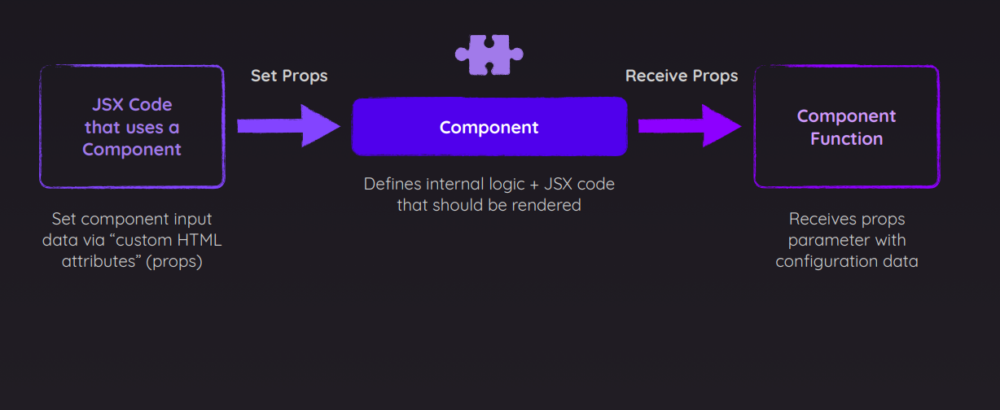
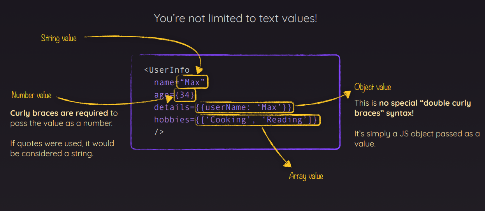
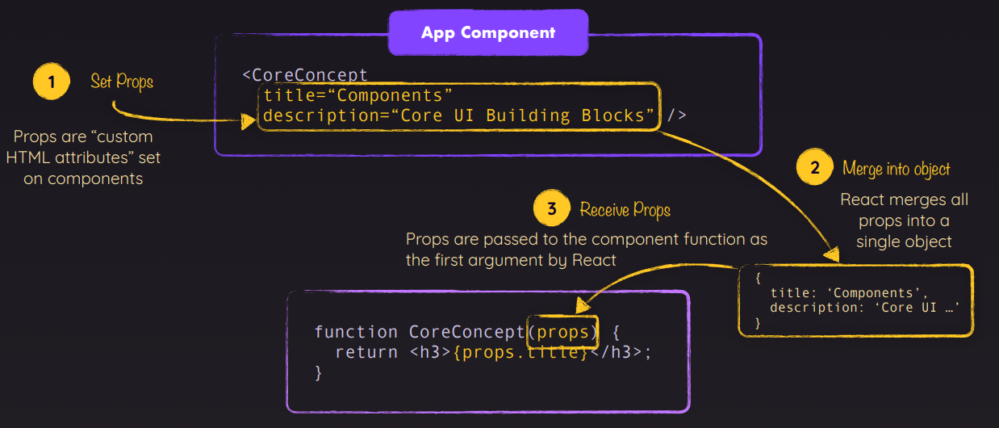
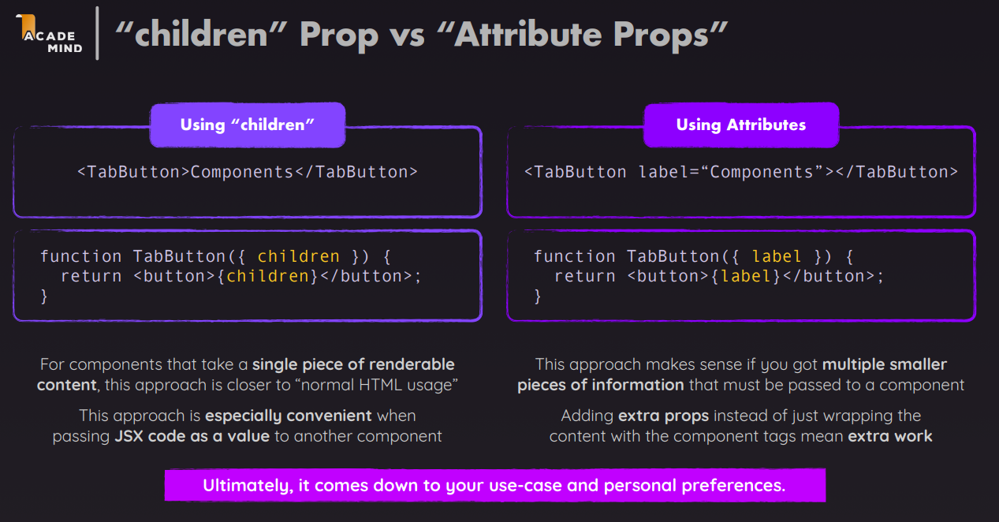
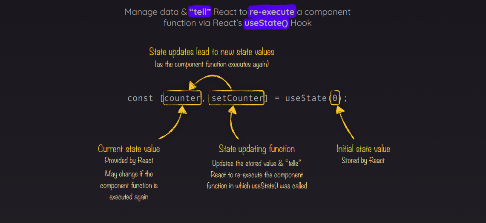
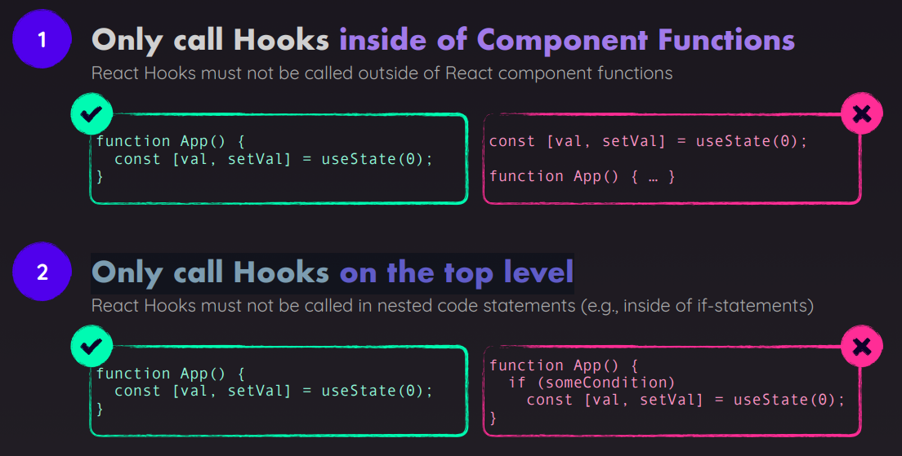

- [Section 1: Getting Started](#section-1-getting-started)
- [Section 2: Javascript refresher](#section-2-javascript-refresher)
- [Section 3: React Enssentials - Component, JSX, Props, State and More](#section-3-react-enssentials---component-jsx-props-state-and-more)
  - [3.1 Component](#31-component)
  - [3.2 Configuring Components With “Props”](#32-configuring-components-with-props)
  - [3.3 How React Checks If UI Updates Are Needed](#33-how-react-checks-if-ui-updates-are-needed)

# Section 1: Getting Started

# Section 2: Javascript refresher

# Section 3: React Enssentials - Component, JSX, Props, State and More

## 3.1 Component

**React Apps Are Built By Combining Components**

- Components
- JSX
- Props

**Build User Interfaces With Components**

- Any website or app can be broken down into smaller building blocks: Component

  

**Why Components?**

- Reusable Building Blocks
  - Create small building blocks & compose the UI from them
  - If needed: Reuse a building block in di!erent parts of the UI (e.g., a reusable button)
- Related Code Lives Together
  - Related HTML & JS (and possibly CSS) code is stored together
  - Since JS influences the output, storing JS + HTML together makes sense
- Separation of Concerns
  - Di!erent components handle di!erent data & logic
  - Vastly simplifies the process of working on complex apps

**Describe The Target UI With JSX**

- JavaScript Syntax eXtension (JSX): Used to describe & create HTML elements in JavaScript in a declarative way
- Component Functions Must Follow Two Rules:
  - Name Starts With Uppercase Character
    - The function name must start with an uppercase character
    - Multi-word names should be written in PascalCase (e.g., “MyHeader”)
    - It’s recommended to pick a name that describes the UI building block (e.g., “Header” or “MyHeader”)
  - Returns “Renderable” Content
    - The function must return a value that can be rendered (“displayed on screen”) by React
    - In most cases: Return JSX Also allowed: string, number, boolean, null, array of allowed values

**Building a Component Hierarchy**



**From Component Tree To DOM Node Tree**



**Outputting Dynamic Content in JSX**

- Static Content: Content that’s hardcoded into the JSX code. Can’t change at runtime

```
<h1>Hello World!</h1>
```

- Dynamic Content: Logic that produces the actual value is added to JSX. Content / value is derived at runtime

```
<h1>{userName}</h1>
```

**React Projects & “The Build Process”**



**Example react componet**

```
import reactImg from '../../assets/react-core-concepts.png';
import './Header.css';

const reactDescription = ['Fundamental', 'Crucial', 'Core'];
function genRandomInt(max) {
  return Math.floor(Math.random() * (max + 1));
}

function Header() {
  return (
    <header>
      
      <h1>React Essentials</h1>
      <p>
        {reactDescription[genRandomInt(2)]} Fundamental React concepts you will
        need for almost any app you are going to build!
      </p>
    </header>
  );
}

export default Header;
```

## 3.2 Configuring Components With “Props”

**React allows you to pass data to components via a concept called “Props”**





**Understanding Props**



```
import { CORE_CONCEPTS, EXAMPLES } from './data.js';

const list = CORE_CONCEPTS.map((item) => {
  return <CoreConcept key={item.title} {...item}></CoreConcept>;
});
```

```
<TabButton
  isActive={tabContent === 'components'}
  onSelect={() => handleClick('components')}
  children="Components"
></TabButton>
```

```
function TabButton({ children, onSelect, isActive }) {
  return (
    <li>
      <button className={isActive ? 'active' : ''} onClick={onSelect}>
        {children}
      </button>
    </li>
  );
}

export default TabButton;

```

**“children” Prop vs “Attribute Props”**



## 3.3 How React Checks If UI Updates Are Needed

**useState() Yields An Array With Two Elements**

- First, import useState from React:

```
import { useState } from 'react';
```

- Declare a state variable inside your component

```
function MyButton() {
  const [count, setCount] = useState(0);
  .....
}
```



**useState() Yields An Array With Two Elements**

- Only call Hooks inside of Component Functions
- Only call Hooks on the top level


